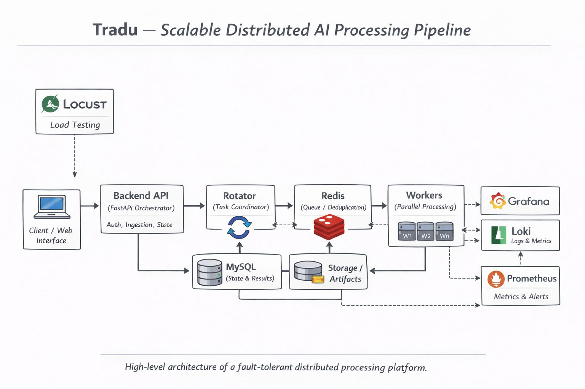
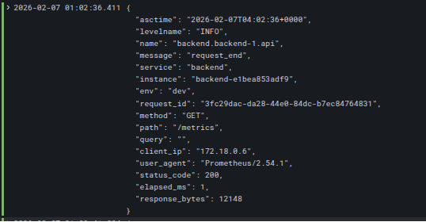
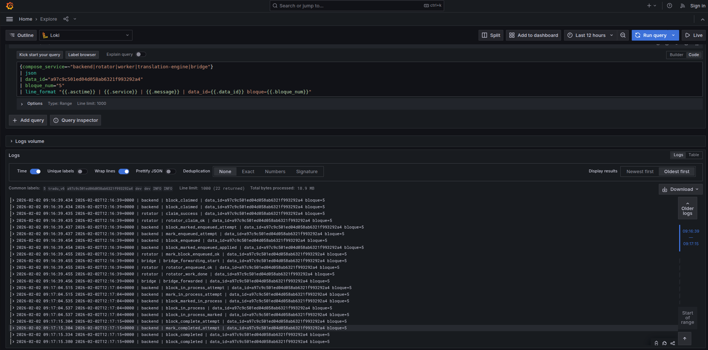
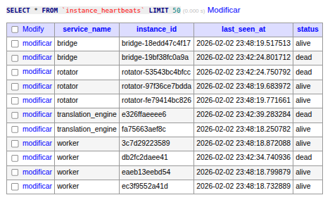

#  Case Study — Tradu: Distributed AI Document Processing Platform

## Overview

Tradu is a production-grade, distributed platform designed for large-scale
multilingual document processing using AI models.

It operates as an asynchronous, fault-tolerant pipeline composed of
independent microservices coordinated through explicit domain contracts
and observability mechanisms.

This case study documents the architectural decisions, operational
challenges, and system-level solutions implemented to ensure reliability,
scalability, and auditability.

---

## Problem Statement

Processing large multilingual datasets with AI models presents multiple
challenges:

- High computational cost
- Long-running asynchronous tasks
- Partial failures
- Service restarts
- Inconsistent execution states
- Limited traceability in distributed environments

Traditional batch pipelines and monolithic systems proved insufficient
for guaranteeing correctness and operational control at scale.

Tradu was designed to address these limitations.

---

## System Architecture

The platform follows a modular, service-oriented architecture with clear
separation of concerns.

Core components include:

- Backend Orchestrator (API & State Management)
- Rotator (Block Scheduling & Claiming)
- Worker Pool (Distributed Processing)
- Translation Engine (AI Inference Layer)
- Bridge (Message & Data Forwarding)
- Redis / MySQL (State & Coordination)
- Loki / Prometheus / Grafana (Observability)

Each service operates independently and communicates through explicit,
versioned interfaces.

The system follows Hexagonal Architecture and Domain-Driven Design
principles.

It highlights the separation of concerns, fault-tolerant coordination,
and observability layers.

---

## Processing Model

Incoming datasets are divided into logical processing units called
**Blocks**.

Each block represents an atomic unit of work and follows a deterministic
lifecycle:

1. Created
2. Claimed
3. Enqueued
4. In-Process
5. Completed / Failed / Cancelled

All transitions are validated through domain rules and persisted.

This model enables:

- Horizontal scalability
- Fine-grained recovery
- Partial reprocessing
- Controlled retries

---

## Observability & Traceability

A core design goal of Tradu is full operational visibility.

All services emit structured JSON logs enriched with:

- request_id
- data_id
- block_id
- instance_id
- state transitions
- execution metadata

Logs are centralized using Loki and visualized in Grafana.

This enables full reconstruction of execution paths across services.

📊 Structured Log Event Example

Each log entry includes contextual metadata enabling cross-service correlation,
performance analysis, and forensic debugging.

---

## 📊 End-to-End Block Execution Trace

The following trace illustrates the complete lifecycle of a processing
block across distributed services, reconstructed from domain-aware
structured logs.

It demonstrates how a single block traverses multiple independent
components while maintaining consistency and auditability.

---

## Reliability Mechanisms

To guarantee system stability under failure conditions, several
mechanisms were implemented:

### Watchdog Layers

- Service-level heartbeats
- Instance-level liveness tracking
- Block-level TTL monitoring

These watchdogs automatically detect and recover:

- Zombie processes
- Orphaned blocks
- Stalled executions
- Network partitions

---

### 📡 Instance Heartbeat Monitoring

Each service instance periodically reports its liveness status to the central
coordination database.

This enables real-time detection of crashed, stalled, or orphaned processes.

The heartbeat registry supports automatic cleanup, recovery workflows,
and forensic post-incident analysis.

---

### Retry & Escalation Policy

Each block maintains explicit retry counters and failure metadata.

Policies include:

- Controlled retries
- Progressive backoff
- Deterministic failure closure
- Manual recovery hooks

This prevents infinite loops and silent data corruption.

---

## Scalability Strategy

Tradu scales horizontally through:

- Stateless service instances
- Distributed task queues
- Dynamic worker pools
- Idempotent state transitions

New capacity can be added without system downtime.

The architecture supports:

- Multi-node deployment
- Load-based autoscaling
- Resource isolation

---

## Operational Outcomes

The implemented architecture enabled:

- Reliable processing of large multilingual corpora
- Deterministic auditing of executions
- Rapid incident diagnosis
- Safe partial reprocessing
- Predictable failure handling

System observability reduced mean-time-to-recovery (MTTR) and improved
operational confidence.

---

## Technical Stack

- Python / FastAPI
- Celery / Redis
- MySQL
- Docker / Docker Compose
- Loki / Prometheus / Grafana
- Structured Logging
- Domain-Driven Design

---

## Professional Context

This project represents the transition from applied data science and
prototyping toward production-grade distributed AI systems.

It reflects a focus on:

- System reliability
- Observability
- Long-term maintainability
- Operational excellence

The architecture and practices developed in Tradu form the foundation of
subsequent large-scale AI platform work.

---

## Author

Leonardo Martinelli  
Senior Data Scientist & Distributed Systems Engineer

